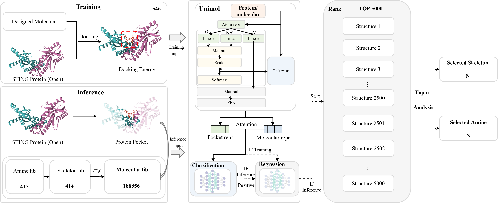

<p align="center"></p>
<p align="center"><b>Schematic illustration of the Model's framework</b></p>

# Install
- pytorch is required, please install pytorch according to your environment. if you are using cuda, please install pytorch with cuda. More details can be found at https://pytorch.org/get-started/locally/
- currently, rdkit needs with numpy<2.0.0, please install rdkit with numpy<2.0.0.
- Uni-Mol is a universal 3D molecular pretraining framework that offers a significant expansion of representation capacity and application scope in drug design. You can get more detailed information [Uni-mol](https://github.com/deepmodeling/Uni-Mol/tree/main).

```python
## Dependencies installation
conda env create -f environment.yml

git clone https://github.com/dptech-corp/Uni-Core.git
cd Uni-Core
pip install .
```

# Inference

## Get protein pocket representation

```shell
python get_protein_repr.py \
    --data  ./Data/PDB \
    --job_name  get_protein_repr \
    --results_path  ./Data/PDB/results \
    --weight_path  ./Unimol/unimol_tools/unimol_tools/weights/pocket_pre_220816.pt 
```

## Test
```shell
python Test.py \
    --model  ./Model \
    --data  ./Data/melocular_lib.csv \
    --out  ./result \
    --protein_path ./Data/PDB/repr
```

## Analysis
```shell
python Analysis.py \
    --Classification  ./result/classification_results.csv \
    --Regression  ./result/regression_results.csv \
    --save  ./result \
    --cutoff 5000
```

# Training
If you want to retrain the Model,  use the commands behind.

```shell
python Train.py \
    --task regression \
    --data  ./Data \
    --data_type  molecule \
    --epochs  30 \
    --batch_size  16 \ 
    --save_path  ./Model 
```

License
-------
